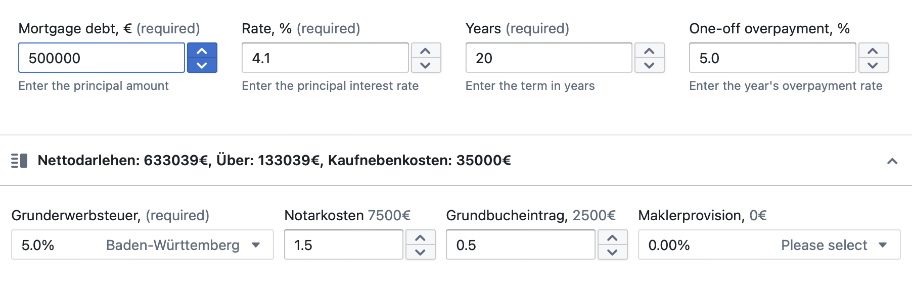

# Table of Contents
1. [Technical Information](#Technical-Information)
2. [Purpose of the mortgage calculator](#Purpose-of-the-mortgage-calculator)
2. [How it works](#How-it-works)
3. [Input data](#Input-data)
4. [Result](#Result) 

## Technical information

## Purpose of the mortgage calculator
The mortgage calculator is designed to calculate the mortgage payment depending on the input data.  

## How it works
The mortgage consists of 2 parts: input data and results. For receiving the result you should input your data in the first part:

## Input data
| **Action** | **Screenshot** |
--- | --- 
| In the field “Mortgage debit” enter the amount of your Mortgage, using the arrow “Up” and “Down” | col2 text | 
| col1 text | col2 text | 
| col1 text | col2 text | 
| col1 text | col2 text |
| col1 text | col2 text | 
| col1 text | col2 text | 
| col1 text | col2 text | 
| col1 text | col2 text | 
| col2 text | col3 text | 

## Result  
[Nathalie.Chorna@gmail.com](mailto:Nathalie.Chorna@gmail.com)

